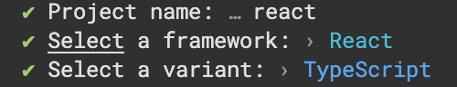

# Vue

- [Prettier](https://prettier.io/)
- [ESLint](https://eslint.org/)
- [Stylelint](https://stylelint.io/)

<br />

## Prettier

### Config File

- [`.prettierrc.cjs`](./.prettierrc.cjs)
- [`.prettierignore`](./.prettierignore)

### Module

#### Base

- [`prettier`](https://www.npmjs.com/package/prettier)

#### Plugins

- [`prettier-plugin-jsdoc`](https://www.npmjs.com/package/prettier-plugin-jsdoc)

#### Installation

```bash
npm i -D prettier prettier-plugin-jsdoc
```

<br />

## ESLint

### Config File

- [`.eslintrc.cjs`](./.eslintrc.cjs)
- [`.eslintignore`](./.eslintignore)

### Module

#### Base

- [`eslint`](https://www.npmjs.com/package/eslint)
- [`@rushstack/eslint-patch`](https://www.npmjs.com/package/@rushstack/eslint-patch)

#### Plugins

- [`eslint-plugin-import`](https://www.npmjs.com/package/eslint-plugin-import)
- [`eslint-import-resolver-typescript`](https://www.npmjs.com/package/eslint-import-resolver-typescript)
- [`eslint-plugin-sort-keys-custom-order`](https://www.npmjs.com/package/eslint-plugin-sort-keys-custom-order)
- [`@typescript-eslint/eslint-plugin`](https://www.npmjs.com/package/@typescript-eslint/eslint-plugin)
- [`@typescript-eslint/parser`](https://www.npmjs.com/package/@typescript-eslint/parser)

#### Plugins for React

- [`eslint-plugin-react`](https://www.npmjs.com/package/eslint-plugin-react)
- [`eslint-plugin-react-hooks`](https://www.npmjs.com/package/eslint-plugin-react-hooks)
- [`eslint-plugin-react-refresh`](https://www.npmjs.com/package/eslint-plugin-react-refresh)
- [`eslint-plugin-jsx-a11y`](https://www.npmjs.com/package/eslint-plugin-jsx-a11y)

#### Installation

```bash
npm i -D eslint @rushstack/eslint-patch eslint-plugin-import eslint-import-resolver-typescript eslint-plugin-sort-keys-custom-order @typescript-eslint/eslint-plugin @typescript-eslint/parser eslint-plugin-react eslint-plugin-react-hooks eslint-plugin-react-refresh eslint-plugin-jsx-a11y
```

<br />

## Stylelint

### Config File

- [`.stylelintrc.cjs`](./.stylelintrc.cjs)
- [`.stylelintignore`](./.stylelintignore)

### Module

#### Base

- [`stylelint`](https://www.npmjs.com/package/stylelint)

#### Plugins

- [`stylelint-config-recess-order`](https://www.npmjs.com/package/stylelint-config-recess-order)
- [`stylelint-declaration-block-no-ignored-properties`](https://www.npmjs.com/package/stylelint-declaration-block-no-ignored-properties)

#### Installation

```bash
npm i -D stylelint stylelint-config-recess-order stylelint-declaration-block-no-ignored-properties
```

<br />

## Typescript Config

⚠️ Vue では `tsconfig.json` を調整しておらず、`pnpm create vue` で生成したものを使用している。

- [`tsconfig.json`](./tsconfig.json)
- [`tsconfig.app.json`](./tsconfig.app.json)
- [`tsconfig.node.json`](./tsconfig.node.json)

### Module

#### Base

- [`typescript`](https://www.npmjs.com/package/typescript)

#### Configs

- [`@tsconfig/node18`](https://www.npmjs.com/package/@tsconfig/node18)
- [`@vue/tsconfig`](https://www.npmjs.com/package/@vue/tsconfig)

#### Types

- [`@types/node`](https://www.npmjs.com/package/@types/node)

```bash
npm i -D typescript @tsconfig/node18 @vue/tsconfig @types/node
```

<br />

## VSCode Config

### Config File

- [`.vscode/settings.json`](./.vscode/settings.json)

### Recommend Extension

- [`.vscode/extensions.json`](./.vscode/extensions.json)

<br />

## Commands

### `check`

`vue-tsc`・`prettier`・`eslint`・`prettier` のチェックを並列で実行する。

```bash
npm run check
```

### `format`

`vue-tsc`・`prettier`・`eslint`・`prettier` のフォーマットを並列で実行する

```bash
npm run format
```

<br>

## 使用したテンプレート

`pnpm create vite` を実行し作成したプロジェクトを使用。

### 生成時のコマンド



<details>
  <summary><b>テキストログ</b></summary>
<div>

```zsh
✔ Project name: … react
✔ Select a framework: › React
✔ Select a variant: › TypeScript
```

</div>
</details>
