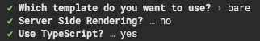

# Solid

- **[Prettier](#prettier)**

  - https://prettier.io

- **[ESLint](#eslint)**

  - https://eslint.org

- **[Stylelint](#stylelint)**

  - https://stylelint.io

<br />

## Prettier

### Config File

- [`./.prettierrc.cjs`](./.prettierrc.cjs)
- [`./.prettierignore`](./.prettierignore)

### Module

#### Base

- [`prettier`](https://www.npmjs.com/package/prettier)

#### Plugins

- [`prettier-plugin-jsdoc`](https://www.npmjs.com/package/prettier-plugin-jsdoc)

#### Installation

```bash
npm i -D prettier prettier-plugin-jsdoc
```

<br />

## ESLint

### Config File

- [`./.eslintrc.cjs`](./.eslintrc.cjs)
- [`./.eslintignore`](./.eslintignore)

### Module

#### Base

- [`eslint`](https://www.npmjs.com/package/eslint)
- [`@rushstack/eslint-patch`](https://www.npmjs.com/package/@rushstack/eslint-patch)
- [`eslint-config-prettier`](https://www.npmjs.com/package/eslint-config-prettier)

#### Plugins

- [`eslint-plugin-import`](https://www.npmjs.com/package/eslint-plugin-import)
- [`eslint-import-resolver-typescript`](https://www.npmjs.com/package/eslint-import-resolver-typescript)
- [`eslint-plugin-sort-keys-custom-order`](https://www.npmjs.com/package/eslint-plugin-sort-keys-custom-order)
- [`@typescript-eslint/eslint-plugin`](https://www.npmjs.com/package/@typescript-eslint/eslint-plugin)
- [`@typescript-eslint/parser`](https://www.npmjs.com/package/@typescript-eslint/parser)

#### Plugins for Solid

- [`eslint-plugin-solid`](https://www.npmjs.com/package/eslint-plugin-solid)
- [`eslint-plugin-react`](https://www.npmjs.com/package/eslint-plugin-react)
- [`eslint-plugin-jsx-a11y`](https://www.npmjs.com/package/eslint-plugin-jsx-a11y)

#### Installation

```bash
npm i -D eslint @rushstack/eslint-patch eslint-plugin-import eslint-import-resolver-typescript eslint-plugin-sort-keys-custom-order @typescript-eslint/eslint-plugin @typescript-eslint/parser eslint-plugin-solid eslint-plugin-react eslint-plugin-jsx-a11y
```

<br />

## Stylelint

### Config File

- [`./.stylelintrc.cjs`](./.stylelintrc.cjs)
- [`./.stylelintignore`](./.stylelintignore)

### Module

#### Base

- [`stylelint`](https://www.npmjs.com/package/stylelint)

#### Plugins

- [`stylelint-config-html`](https://www.npmjs.com/package/stylelint-config-html)
- [`stylelint-config-recess-order`](https://www.npmjs.com/package/stylelint-config-recess-order)
- [`stylelint-declaration-block-no-ignored-properties`](https://www.npmjs.com/package/stylelint-declaration-block-no-ignored-properties)

#### Installation

```bash
npm i -D stylelint stylelint-config-html stylelint-config-recess-order stylelint-declaration-block-no-ignored-properties
```

<br />

## Typescript Config

⚠️ Typescript Config は調整しておらず、テンプレートの設定を流用しているだけ

### Config File

- [`./tsconfig.json`](./tsconfig.json)

### Module

#### Base

- [`typescript`](https://www.npmjs.com/package/typescript)

#### Types

- [`@types/node`](https://www.npmjs.com/package/@types/node)

```bash
npm i -D typescript @types/node
```

<br />

## VSCode Config

### Config File

- [`./.vscode/settings.json`](./.vscode/settings.json)

### Recommend Extension

- [`./.vscode/extensions.json`](./.vscode/extensions.json)

<br />

## Commands

### Module

#### Plugins

- [`concurrently`](https://www.npmjs.com/package/concurrently)

#### Installation

```bash
npm i -D concurrently
```

### `check`

`tsc`・`prettier`・`eslint`・`prettier` を用いた静的解析を**並列**で実行する。

```bash
npm run check
```

### `format`

`prettier`・`eslint`・`prettier` を用いたフォーマットを**並列**で実行する。

```bash
npm run format
```

<br>

## 使用したテンプレート

`pnpm create solid` を実行し作成したプロジェクトを使用。

### 生成時のコマンド



<details>
  <summary><b>テキストログ</b></summary>
<div>

```zsh
✔ Which template do you want to use? › bare
✔ Server Side Rendering? … no
✔ Use TypeScript? … yes
```

</div>
</details>
