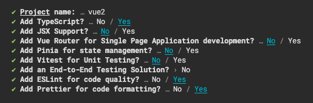

# Vue

- [Prettier](https://prettier.io/)
- [ESLint](https://eslint.org/)
- [Stylelint](https://stylelint.io/)

<br />

## Prettier

### Base

- [`prettier`](https://www.npmjs.com/package/prettier)

### Plugins

- [`prettier-plugin-jsdoc`](https://www.npmjs.com/package/prettier-plugin-jsdoc)
- [`prettier-plugin-organize-attributes`](https://www.npmjs.com/package/prettier-plugin-organize-attributes)

### Installation

```bash
npm i -D prettier prettier-plugin-jsdoc prettier-plugin-organize-attributes
```

<br />

## Eslint

### Base

- [`eslint`](https://www.npmjs.com/package/eslint)
- [`@rushstack/eslint-patch`](https://www.npmjs.com/package/@rushstack/eslint-patch)

### Vue's Plugins

- [`eslint-plugin-vue`](https://www.npmjs.com/package/eslint-plugin-vue)
- [`@vue/eslint-config-prettier`](https://www.npmjs.com/package/@vue/eslint-config-prettier)
- [`@vue/eslint-config-typescript`](https://www.npmjs.com/package/@vue/eslint-config-typescript)

### Plugins

- [`eslint-plugin-import`](https://www.npmjs.com/package/eslint-plugin-import)
- [`eslint-import-resolver-typescript`](https://www.npmjs.com/package/eslint-import-resolver-typescript)
- [`eslint-plugin-sort-keys-custom-order`](https://www.npmjs.com/package/eslint-plugin-sort-keys-custom-order)

### Installation

```bash
npm i -D eslint @rushstack/eslint-patch eslint-plugin-vue @vue/eslint-config-prettier @vue/eslint-config-typescript eslint-plugin-import eslint-import-resolver-typescript eslint-plugin-sort-keys-custom-order
```

<br />

## Stylelint

### Base

- [`stylelint`](https://www.npmjs.com/package/stylelint)

### Plugins

- [`stylelint-config-html`](https://www.npmjs.com/package/stylelint-config-html)
- [`stylelint-config-recess-order`](https://www.npmjs.com/package/stylelint-config-recess-order)
- [`stylelint-declaration-block-no-ignored-properties`](https://www.npmjs.com/package/stylelint-declaration-block-no-ignored-properties)

### Installation

```bash
npm i -D stylelint stylelint-config-html stylelint-config-recess-order stylelint-declaration-block-no-ignored-properties
```

<br />

## Typescript Config

⚠️ Vue では `tsconfig.json` を調整しておらず、`pnpm create vue` で生成したものを使用している。

### Base

- [`typescript`](https://www.npmjs.com/package/typescript)

### Configs

- [`@tsconfig/node18`](https://www.npmjs.com/package/@tsconfig/node18)
- [`@vue/tsconfig`](https://www.npmjs.com/package/@vue/tsconfig)

### Types

- [`@types/node`](https://www.npmjs.com/package/@types/node)

```bash
npm i -D typescript @tsconfig/node18 @vue/tsconfig @types/node
```

<br />

## 関連コマンド

### `check`

`vue-tsc`・`prettier`・`eslint`・`prettier` のチェックを並列で実行する。

```bash
npm run check
```

### `format`

`vue-tsc`・`prettier`・`eslint`・`prettier` のフォーマットを並列で実行する

```bash
npm run format
```

<br>

## 使用したテンプレート

`pnpm create vue` を実行し作成したプロジェクトを使用。

### 生成時のコマンド



<details>
  <summary><b>テキストログ</b></summary>
<div>

```zsh
✔ Project name: … vue
✔ Add TypeScript? …  Yes
✔ Add JSX Support? … No
✔ Add Vue Router for Single Page Application development? … No
✔ Add Pinia for state management? … No
✔ Add Vitest for Unit Testing? … No
✔ Add an End-to-End Testing Solution? › No
✔ Add ESLint for code quality? … Yes
✔ Add Prettier for code formatting? … Yes
```

</div>
</details>
